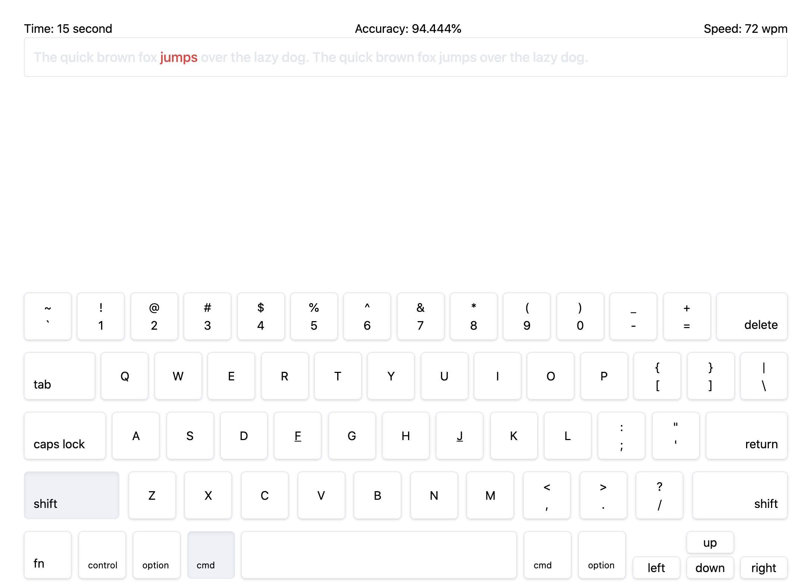

# [WIP] Sepuluh Jari [](https://app.netlify.com/sites/sepuluhjari/deploys)
Aplikasi web based untuk melatih kecepatan mengetik dengan sepuluh jari. [Demo](https://sepuluhjari.netlify.app)



Built with VueJS, TailwindCSS

## Project setup
```
npm install
```

### Compiles and hot-reloads for development
```
npm run serve
```

### Compiles and minifies for production
```
npm run build
```

### Lints and fixes files
```
npm run lint
```

### Customize configuration
See [Configuration Reference](https://cli.vuejs.org/config/).
